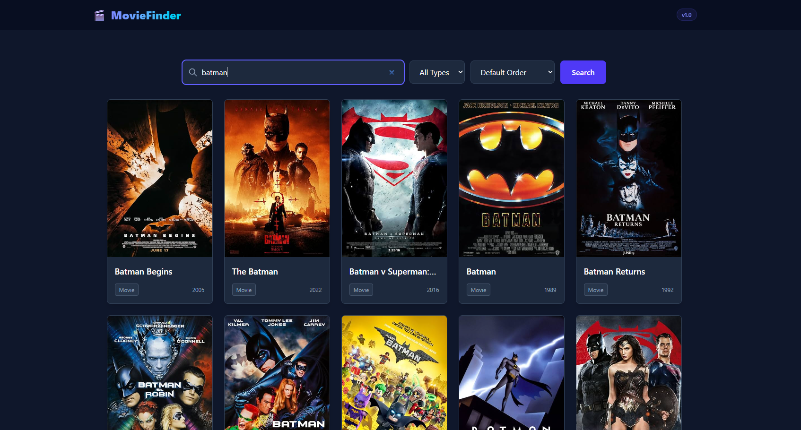
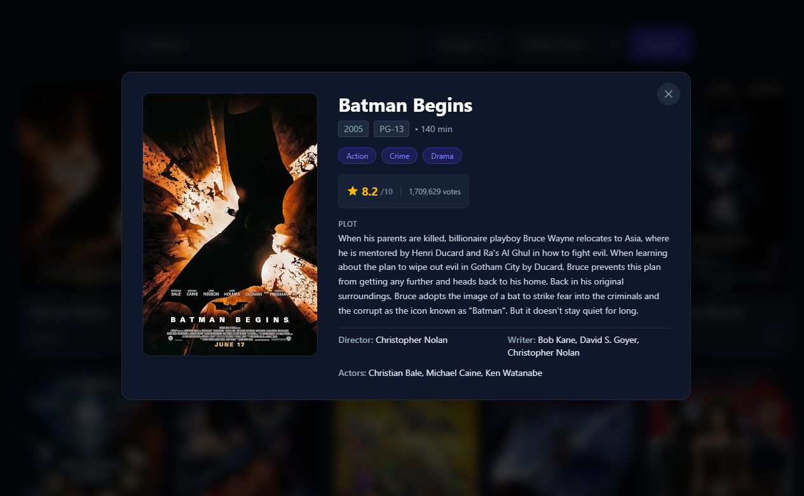

# 🎬 Movie Explorer App

A modern, responsive React 19 application for searching movies, series, and episodes using the OMDB API. Features server-side pagination, sorting, content filtering, and debouncing.

🚀 **Live Demo:** [https://movie-explorer-app-beta.vercel.app/](https://movie-explorer-app-beta.vercel.app/)

---

## 📸 Screenshots

|              Search & Filtering              |           Movie Details Modal            |
| :------------------------------------------: | :--------------------------------------: |
|  |  |

---

## ✨ Features

- **Debounced Search:** Custom hook implementation to limit API calls during typing.
- **Filtering & Sorting:** Filter by content type (Movies, Series, Episodes) and sort results by release year.
- **Server-Side Pagination:** Smooth navigation between search result pages with automatic scroll-to-top.
- **Movie Details Modal:** Fetch detailed metadata (Plot, Cast, Ratings, Runtime) via TanStack Query.
- **Responsive Layout:** Built with Tailwind CSS v4, fully adaptable for desktop and mobile devices.
- **Type Safety:** Strict TypeScript interfaces for API responses and component props.

---

## 🛠️ Tech Stack & Architecture

- **Framework & Build Tool:** React 19, Vite, TypeScript
- **State & Data Fetching:** TanStack Query v5, Axios
- **Styling:** Tailwind CSS v4
- **Performance Patterns:**
  - `useDebounce` hook for rate-limiting search requests.
  - `useMemo` for client-side sorting without redundant recalculations.
  - `useRef` (Latest Ref pattern) for stable callback references in search effects.

---

## 🚀 Getting Started Locally

### Prerequisites

- Node.js (v18 or higher)
- npm
- A free OMDB API key from [omdbapi.com](https://www.omdbapi.com/apikey.aspx)

### Installation

1. **Clone the repository:**

```bash
   git clone https://github.com/nickdimizas/movie-explorer-app.git
   cd movie-explorer-app
```

2. **Install dependencies:**

```bash
   npm install
```

3. **Set up environment variables:** create a `.env` file in the root directory and add your OMDB API key:

```env
   VITE_OMDB_API_KEY=your_api_key_here
```

4. **Run the development server:**

```bash
   npm run dev
```

The app will be available at `http://localhost:5173`.

---

## 📁 Project Structure

```text
src/
├── apis/              # API calls (movie.ts)
├── components/
│   ├── layout/        # Header, Footer, MainLayout
│   ├── movies/        # MovieGrid, MovieCard, MovieDetailsModal, MovieSearchContainer
│   └── ui/            # SearchBar, Pagination
├── hooks/             # Custom hooks (useMovies, useDebounce)
└── types/             # TypeScript definitions
```

---

## 👤 Author

**Your Name** – [GitHub](https://github.com/your-username) · [LinkedIn](https://www.linkedin.com/in/your-profile)
